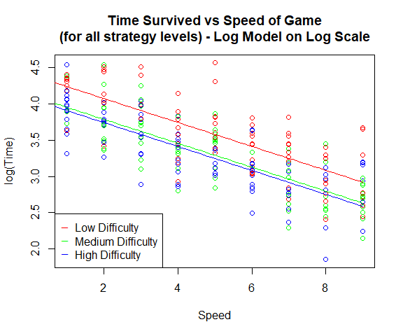

ENGSCI 314 Assignment 3
================
Navindd Raj 822790840
Due Date: 1pm Tuesday, 29th May 2018

    ## Loading required package: s20x

## **Question 1**

### Question of interest/goal of the study

We want to find out what effect several different variables have on the
length of time players survive in a game.

### Read in and inspect the data:

``` r
game.df=read.table("game14.txt",header=TRUE)
head(game.df)
```

    ##   Time Speed Strategy Background StrategyC BackgroundC
    ## 1 13.5     8      Med      Rural         M           R
    ## 2 63.0     4      Low      Urban         L           U
    ## 3 37.7     1      Low      Urban         L           U
    ## 4 17.1     7      Low    Factory         L           F
    ## 5 31.4     7      Low    Factory         L           F
    ## 6 12.6     8     High    Factory         H           F

``` r
pairs20x(game.df[1:4])
```

<!-- -->

Response variable is time and the rest are explanatory variables.

We can see from the pairs plot that both speed and strategy are related
to survival time, while background seems to have no apparent effect on
time. We can see that there appears to be a non-linear trend in speed vs
time, which we should look into later. There appears to be little
correlation within the explanatory variables, so we aren’t in danger of
variable interaction.

### Fit model and check assumptions

We shouldn’t have to worry about interaction between explanatory
variables as there appears to be very little correlation here. Let’s
first fit a model using all of the explanatory variables to be sure of
what is happenening, then progress to a simpler model if possible.

``` r
# fit the model
game.fit = lm(Time ~ Speed + Strategy + Background, data = game.df)

# assumption checks
plot(game.fit, which = 1)
```

<!-- -->

Slight curvature spotted in the residuals, which could violate the
equality of variance assumption. Will look into it later.

``` r
normcheck(game.fit)
```

<!-- -->

Normality check seems *okay*, it is not too wild but we have a large
dataset so can invoke the CLT if necessary. There is evidence of
right-skewed data though, which we should look into by maybe logging the
response variable.

``` r
cooks20x(game.fit)
```

<!-- -->

No points of undue influence, can move on to next stage of analysis.

``` r
# get fit summary info
summary(game.fit)
```

    ## 
    ## Call:
    ## lm(formula = Time ~ Speed + Strategy + Background, data = game.df)
    ## 
    ## Residuals:
    ##     Min      1Q  Median      3Q     Max 
    ## -27.742  -7.852  -1.395   5.623  54.515 
    ## 
    ## Coefficients:
    ##                 Estimate Std. Error t value Pr(>|t|)    
    ## (Intercept)      56.6951     2.4093  23.532  < 2e-16 ***
    ## Speed            -5.3571     0.3199 -16.747  < 2e-16 ***
    ## StrategyLow      11.8898     1.9950   5.960 9.08e-09 ***
    ## StrategyMed       1.9852     2.0395   0.973    0.331    
    ## BackgroundRural  -0.7144     2.1237  -0.336    0.737    
    ## BackgroundUrban  -0.9794     2.0061  -0.488    0.626    
    ## ---
    ## Signif. codes:  0 '***' 0.001 '**' 0.01 '*' 0.05 '.' 0.1 ' ' 1
    ## 
    ## Residual standard error: 12.8 on 237 degrees of freedom
    ## Multiple R-squared:  0.5692, Adjusted R-squared:  0.5601 
    ## F-statistic: 62.64 on 5 and 237 DF,  p-value: < 2.2e-16

``` r
anova(game.fit)
```

    ## Analysis of Variance Table
    ## 
    ## Response: Time
    ##             Df Sum Sq Mean Sq  F value    Pr(>F)    
    ## Speed        1  44675   44675 272.6012 < 2.2e-16 ***
    ## Strategy     2   6610    3305  20.1659  8.17e-09 ***
    ## Background   2     40      20   0.1234     0.884    
    ## Residuals  237  38841     164                       
    ## ---
    ## Signif. codes:  0 '***' 0.001 '**' 0.01 '*' 0.05 '.' 0.1 ' ' 1

As expected, we can see the p-values for background in the summary and
anova table are very high and considered insignificant. In this case, it
is safe to ditch the “Background” variable for future models. We can see
that in relation to “StrategyHigh”, StrategyLow has much more
significance in trend than StrategyMedium, with StrategyMedium having a
nonsignificant p-value. However, we should still keep the strategy
variable in the model because of the strong significance from the
StrategyLow p-value. We also see a curvature in the residuals plot,
which we should adress later. There are no points of undue influence,
and normality isn’t bad. For now, let’s re-fit the model without the
background variable and see what changed, and how we can improve from
there.

``` r
# fit simpler model with removed Background variable
game.fit1 = lm(Time ~ Speed + Strategy, data = game.df)

# assumption checks
plot(game.fit1, which = 1)
```

<!-- -->

``` r
normcheck(game.fit1)
```

<!-- -->

The curvature is still present in the residuals plot, and normality
assumption checks hasn’t changed.

``` r
# get fit summary info
summary(game.fit1)
```

    ## 
    ## Call:
    ## lm(formula = Time ~ Speed + Strategy, data = game.df)
    ## 
    ## Residuals:
    ##     Min      1Q  Median      3Q     Max 
    ## -27.871  -7.990  -1.219   5.923  54.375 
    ## 
    ## Coefficients:
    ##             Estimate Std. Error t value Pr(>|t|)    
    ## (Intercept)  56.0891     2.0382  27.519  < 2e-16 ***
    ## Speed        -5.3456     0.3178 -16.819  < 2e-16 ***
    ## StrategyLow  11.8640     1.9854   5.976 8.27e-09 ***
    ## StrategyMed   1.8409     2.0056   0.918     0.36    
    ## ---
    ## Signif. codes:  0 '***' 0.001 '**' 0.01 '*' 0.05 '.' 0.1 ' ' 1
    ## 
    ## Residual standard error: 12.75 on 239 degrees of freedom
    ## Multiple R-squared:  0.5688, Adjusted R-squared:  0.5634 
    ## F-statistic: 105.1 on 3 and 239 DF,  p-value: < 2.2e-16

``` r
anova(game.fit1)
```

    ## Analysis of Variance Table
    ## 
    ## Response: Time
    ##            Df Sum Sq Mean Sq F value    Pr(>F)    
    ## Speed       1  44675   44675 274.616 < 2.2e-16 ***
    ## Strategy    2   6610    3305  20.315 7.109e-09 ***
    ## Residuals 239  38881     163                      
    ## ---
    ## Signif. codes:  0 '***' 0.001 '**' 0.01 '*' 0.05 '.' 0.1 ' ' 1

Now in the anova table, we can see that all of the explanatory variables
used in the model are significant, so we can’t remove any more
variables. To confirm this, we should rotate the model for a final
comparison, which will be done in it’s own section later. Note that the
Adjusted R-squared for this model has slightly improved, yet we have
less variables, which is a good indicator that our simpler model is
better than the previous one.

For now, we should focus on finding the cause of the curvature in the
residuals, also considering the skewness of the data.

By looking at the pairs plot relating of time vs speed, we can see what
appears to be an curved relationship as the largest cause of curvature,
so let’s now try and fit a model with quadratic Speed and see if the
residuals are better.

``` r
# fit model with squared Speed
game.fit2 = lm(Time ~ Speed + I(Speed^2) + Strategy, data = game.df)

# assumption checks
plot(game.fit2, which = 1)
```

<!-- -->

``` r
normcheck(game.fit2)
```

<!-- -->

``` r
cooks20x(game.fit2)
```

<!-- -->

It seems like this has’t really fixed the curvature issue from before,
and there is still some doubt about the scatter of residuals. The
normality check still doesn’t seem to be terrible and still no points of
undue influence. Again though, we see strong evidence of right-skewed
data, so next let’s try fit a logged response variable model to see if
the assumption checks get better.

``` r
# fit model with logged response variable
game.fit3 = lm(log(Time) ~ Speed + Strategy, data = game.df)

# assumption checks
plot(game.fit3, which = 1)
```

<!-- -->

``` r
normcheck(game.fit3)
```

<!-- -->

``` r
cooks20x(game.fit3)
```

<!-- -->

The Q-Q plot looks a lot better now, as does the equality of variance
checks and the normality check. Residuals have an almost constant
scatter, which is what we want. There are still no points of undue
influence.

``` r
# get fit summary info 
summary(game.fit3)
```

    ## 
    ## Call:
    ## lm(formula = log(Time) ~ Speed + Strategy, data = game.df)
    ## 
    ## Residuals:
    ##      Min       1Q   Median       3Q      Max 
    ## -0.89609 -0.23072  0.01403  0.20880  0.98301 
    ## 
    ## Coefficients:
    ##              Estimate Std. Error t value Pr(>|t|)    
    ## (Intercept)  4.069040   0.053920  75.465  < 2e-16 ***
    ## Speed       -0.164581   0.008408 -19.574  < 2e-16 ***
    ## StrategyLow  0.331030   0.052523   6.303  1.4e-09 ***
    ## StrategyMed  0.045368   0.053059   0.855    0.393    
    ## ---
    ## Signif. codes:  0 '***' 0.001 '**' 0.01 '*' 0.05 '.' 0.1 ' ' 1
    ## 
    ## Residual standard error: 0.3374 on 239 degrees of freedom
    ## Multiple R-squared:  0.6369, Adjusted R-squared:  0.6323 
    ## F-statistic: 139.7 on 3 and 239 DF,  p-value: < 2.2e-16

``` r
anova(game.fit3)
```

    ## Analysis of Variance Table
    ## 
    ## Response: log(Time)
    ##            Df Sum Sq Mean Sq F value    Pr(>F)    
    ## Speed       1 42.514  42.514 373.402 < 2.2e-16 ***
    ## Strategy    2  5.216   2.608  22.908 7.908e-10 ***
    ## Residuals 239 27.212   0.114                      
    ## ---
    ## Signif. codes:  0 '***' 0.001 '**' 0.01 '*' 0.05 '.' 0.1 ' ' 1

Again, we can’t move any further variables from this model anymore as
they both have very strong p-values. Overall I think this is the best
model for the given data, as the assumption checks are all satisfied
perfectly by it, and it has the strongest Multiple R-Squared value of
0.6369.

### Create a plot with ‘best’ model superimposed on top of data.

``` r
# generate series of fitted values for plot
xVals = seq(0,9,0.1)

yValsHigh = game.fit3$coef[1] + game.fit3$coef[2]*xVals
yValsLow = game.fit3$coef[1] + game.fit3$coef[2]*xVals + game.fit3$coef[3]
yValsMed = game.fit3$coef[1] + game.fit3$coef[2]*xVals + game.fit3$coef[4]

palette(value=c('blue','red','green'))
plot(log(Time) ~ Speed, main = "Time Survived vs Speed of Game\n(for all strategy levels) - Log Model on Log Scale", data = game.df, col = game.df$StrategyC)
lines(xVals, yValsHigh, col = "blue")
lines(xVals, yValsLow, col = "red")
lines(xVals, yValsMed, col = "green")

legend("bottomleft", legend = c("Low Difficulty", "Medium Difficulty", "High Difficulty"), col = c("red", "green", "blue"), pch = '_')
```

<!-- -->

``` r
# also plot the original data and see what our fit looks like
plot(Time ~ Speed, main = "Time Survived vs Speed of Game\n(for all strategy levels) - Log Model on Normal Scale", data = game.df, col = game.df$StrategyC)
lines(xVals, exp(yValsHigh), col = "blue")
lines(xVals, exp(yValsLow), col = "red")
lines(xVals, exp(yValsMed), col = "green")

legend("topright", legend = c("Low Difficulty", "Medium Difficulty", "High Difficulty"), col = c("red", "green", "blue"), pch = '_')
```

<!-- -->

Overall, it seems the log model fits the data well, and by observing the
trends of each line colour we can see that survival time is not a simple
linear trend for different strategy levels. Therefore, going forward our
final model is the logged response variable one.

### Rotate model for final comparison

We have shown that for this model, if we have Speed, then we also need
Strategy, but what about the other way around? Let’s rotate the model to
find out:

``` r
# refit the model changing the variable order and show anova table
game.fit4 = lm(log(Time) ~ Strategy + Speed, data = game.df)
anova(game.fit4)
```

    ## Analysis of Variance Table
    ## 
    ## Response: log(Time)
    ##            Df Sum Sq Mean Sq F value    Pr(>F)    
    ## Strategy    2  4.108   2.054  18.039 5.053e-08 ***
    ## Speed       1 43.623  43.623 383.140 < 2.2e-16 ***
    ## Residuals 239 27.212   0.114                      
    ## ---
    ## Signif. codes:  0 '***' 0.001 '**' 0.01 '*' 0.05 '.' 0.1 ' ' 1

As we can see, both variables are still significant and thus our model
is complete.

Let’s also make a new model with Medium as the baseline, in order to
compare the medium and low strategies, which will come useful for the
executive summary.

``` r
# create new factor variable
game.df = within(game.df, {StrategyLow = factor(Strategy, levels=c('Low','Med','High'))})
game.fit5 = lm(log(Time) ~ Speed + StrategyLow, data = game.df)
summary(game.fit5)$coef
```

    ##                   Estimate  Std. Error    t value      Pr(>|t|)
    ## (Intercept)      4.4000702 0.057351344  76.721309 2.392641e-170
    ## Speed           -0.1645813 0.008408173 -19.573961  1.463387e-51
    ## StrategyLowMed  -0.2856625 0.053868975  -5.302913  2.593730e-07
    ## StrategyLowHigh -0.3310305 0.052523266  -6.302549  1.398543e-09

We find that the difference between medium and low is significant
(p-value 2.59e-07). We should get the confidence intervals for our
executive summary too:

``` r
# confidence interval on log scale
confint(game.fit5)
```

    ##                      2.5 %     97.5 %
    ## (Intercept)      4.2870915  4.5130489
    ## Speed           -0.1811448 -0.1480177
    ## StrategyLowMed  -0.3917811 -0.1795438
    ## StrategyLowHigh -0.4344981 -0.2275628

``` r
# back transformed confidence interval for slope as percentage change
100*(exp(confint(game.fit5)[2:4,])-1)
```

    ##                     2.5 %    97.5 %
    ## Speed           -16.56855 -13.75841
    ## StrategyLowMed  -32.41479 -16.43487
    ## StrategyLowHigh -35.24104 -20.35276

### Method and Assumption Checks

As we have multiple explanatory variables, we have fitted a multiple
linear regression model to the data. The initial residuals plot showed a
distinct curve, meaning equality of variance assumption may have been
violated in the initial model with all explanatory variables. After
dropping the least significant variable “Background” (ANOVA Table
p-value of 0.884), curvature was still present in the residuals plot.
Investigating each explanatory variable, both Speed and Strategy vs
their residuals were plotted, to see which one showed the most
significant contribution to curvature. It seemed like “Speed” was the
variable that was causing this quadratic curvature, but when a quadratic
model was fitted with squared Speed, the residuals still did not look
good, and the quantile-quantile plot still showed evidence of
right-skewed data. Finally, we fit a model with logged response variable
and this cleared all our assumption checks, showing good normality, and
scatter of residuals was almost constant, meaning we have equality of
variance. The data was taken from a large group of playtesters and each
was randomly allocated to play a certain version of the game, so
independence can be assumed with no issues.

After simplifying the model down by removing the “Background” variable,
the remaining variables were significant and there were no problems with
the assumptions of the model. The final model was also rotated to see
the significance of one variable without the other, and it showed that
both explanatory variables “Speed” and “Strategy” were required in the
model.

Our model is:
\(log(Time_{i}) = \beta_{0} + \beta_{1}*Speed_{i} + \beta_{2}*StrategyLow_{i} + \beta_{3}*StrategyMedium_{i} + \epsilon_{i}\),
where StrategyLow is a dummy variable that equals 1 if the strategy
level was set to Low for datapoint i, 0 otherwise, and StrategyMedium is
a dummy variable that equals 1 if the strategy level was set to Medium
for datapoint i, 0 otherwise, and
\(\epsilon_{i} ~ iid N(0,\sigma^{2})\). The baseline strategy for this
model is High, and so there is no dummy variable for when the strategy
is set to High.

### Executive Summary

A manager of a software company which is developing a new game is
interested in seeing what effect several different variables have on the
length of time players survive in the game, in order to further develop
the game. Data was collected by a large number of playtesters randomly
allocated a game with specific settings.

The final model used the “Speed” and “Strategy” setting of the game to
see if there was a difference in the survival time as these two
variables changed. It was found that the background setting for the game
did not affect the survival time of players.

We see a general trend that as the speed setting of the game increases,
the survival time decreases. However, this is not a straightforward
linear trend; as speed decreases, survival time decreases less and less
(even though it *is* still decreasing), i.e. increasing speed has a
larger effect on survival time when speed is low, but not so large of an
effect when speed is high.

We found that the median survival time decreases by between 13.8% to
16.6% per unit increase of speed, regardless of the strategy level
played.

There is also evidence that the strategy setting of the game will also
affect the survival time. People playing on the low strategy level show
significantly longer survival times than those playing on both a medium
or high strategy level for the same speed. We found the median survival
time on Medium strategy level was between 16.4% to 32.4% lower than
those playing on the same speed on Low strategy level. We also found the
median survival time on High strategy level was between 20.4% to 35.2%
lower than those playing on the same speed on Low strategy level.

There was no significant difference in survival time between people
playing on Medium and High strategy levels, for the same speed setting.

This model explains about 64% of the variability in the survival times.

-----

## **Question 2**

### Question of interest/goal of the study

We are interested in seeing whether or not food cooked in different
types of pots have different iron contents, and if these differences
also depend on the type of food cooked.

### Read in and inspect the data:

``` r
iron.df=read.table("Iron.txt",header=TRUE)
interactionPlots(Iron~Pot+Food,data=iron.df)
```

<!-- -->

The profiles of the interaction plot do not appear to be parallel,
indicating the possibility of an interaction between type of food and
type of pot used. The iron content in meat dishes seem to be, on
average, larger than those in vegetable dishes comparatively, with a
larger difference in iron content with meat cooked in iron pots, versus
vegetables cooked in iron pots. The variance of the observations seemed
to be similar for each group.

Let’s try and fit an interaction model and see if this is a good fit for
our data.

### Fit model and check assumptions

``` r
# fit the model with interaction
iron.fit = lm(Iron ~ Pot * Food, data = iron.df)

# assumption checks
plot(iron.fit, which = 1)
```

<!-- -->

Reasonably constant scatter of residuals. May be some doubt about
datapoint 6, which we shall look into later.

``` r
normcheck(iron.fit)
```

<!-- -->

Q-Q plot looks reasonably good, data appears to be relatively normally
distributed with most points in the centre of the distribution.
*Possible* hints of skewness, but should be fine. One thing to note is
that our dataset is relatively small (only 24 observations), so we can’t
confidently invoke the CLT if necessary.

``` r
cooks20x(iron.fit)
```

<!-- -->

Points 6 has an apparently high Cook’s Distance, which we could look
into in the final model by removing this point to see if our model
changes significantly. Should be fine for now though, as none have a
Cook’s Distance of over 0.40.

``` r
# get summary output
anova(iron.fit)
```

    ## Analysis of Variance Table
    ## 
    ## Response: Iron
    ##           Df  Sum Sq Mean Sq F value    Pr(>F)    
    ## Pot        2 21.5208 10.7604 55.3262 2.054e-08 ***
    ## Food       1  7.8547  7.8547 40.3861 5.492e-06 ***
    ## Pot:Food   2  1.6804  0.8402  4.3199   0.02935 *  
    ## Residuals 18  3.5008  0.1945                      
    ## ---
    ## Signif. codes:  0 '***' 0.001 '**' 0.01 '*' 0.05 '.' 0.1 ' ' 1

``` r
summary2way(iron.fit, page = "interaction")
```

    ## 
    ## 
    ## Comparisons within Pot:
    ## 
    ##                                         Estimate Tukey.L Tukey.U Tukey.p
    ## Aluminium.Meat  -  Aluminium.Vegetables   0.8250 -0.1660  1.8160  0.1365
    ## Clay.Meat  -  Clay.Vegetables             0.7175 -0.2735  1.7085  0.2438
    ## Iron.Meat  -  Iron.Vegetables             1.8900  0.8990  2.8810  0.0001
    ## 
    ## 
    ## Comparisons between Pot:
    ## 
    ##                                          Estimate Tukey.L Tukey.U Tukey.p
    ## Aluminium.Meat  -  Clay.Meat              -0.1200 -1.1110  0.8710  0.9987
    ## Aluminium.Vegetables  -  Clay.Vegetables  -0.2275 -1.2185  0.7635  0.9756
    ## Aluminium.Meat  -  Iron.Meat              -2.6225 -3.6135 -1.6315  0.0000
    ## Aluminium.Vegetables  -  Iron.Vegetables  -1.5575 -2.5485 -0.5665  0.0011
    ## Clay.Meat  -  Iron.Meat                   -2.5025 -3.4935 -1.5115  0.0000
    ## Clay.Vegetables  -  Iron.Vegetables       -1.3300 -2.3210 -0.3390  0.0053

We have significant p-values for iron level differences within iron pots
for meat and vegetables, and between iron pots and aluminium pots for
meat and vegetables, and iron pots and clay pots for meat and
vegetables. There is no significant iron level difference between clay
and aluminium pots for meat or vegetables.

``` r
summary(iron.fit)
```

    ## 
    ## Call:
    ## lm(formula = Iron ~ Pot * Food, data = iron.df)
    ## 
    ## Residuals:
    ##      Min       1Q   Median       3Q      Max 
    ## -0.89750 -0.22375  0.08625  0.29875  0.59000 
    ## 
    ## Coefficients:
    ##                        Estimate Std. Error t value Pr(>|t|)    
    ## (Intercept)              2.0575     0.2205   9.331 2.56e-08 ***
    ## PotClay                  0.1200     0.3118   0.385   0.7049    
    ## PotIron                  2.6225     0.3118   8.410 1.19e-07 ***
    ## FoodVegetables          -0.8250     0.3118  -2.646   0.0164 *  
    ## PotClay:FoodVegetables   0.1075     0.4410   0.244   0.8102    
    ## PotIron:FoodVegetables  -1.0650     0.4410  -2.415   0.0266 *  
    ## ---
    ## Signif. codes:  0 '***' 0.001 '**' 0.01 '*' 0.05 '.' 0.1 ' ' 1
    ## 
    ## Residual standard error: 0.441 on 18 degrees of freedom
    ## Multiple R-squared:  0.8987, Adjusted R-squared:  0.8706 
    ## F-statistic: 31.94 on 5 and 18 DF,  p-value: 2.402e-08

We should also check for the anomalous datapoint 6 to see if it has
undue influence on our model:

``` r
# fit interaction model without datapoint 6
iron.fit2 = lm(Iron ~ Pot * Food, data = iron.df[-6,])

# compare the models to see if the estimates change by more than one standard error
summary(iron.fit)$coef
```

    ##                        Estimate Std. Error    t value     Pr(>|t|)
    ## (Intercept)              2.0575  0.2205053  9.3308432 2.564696e-08
    ## PotClay                  0.1200  0.3118415  0.3848108 7.048865e-01
    ## PotIron                  2.6225  0.3118415  8.4097202 1.194660e-07
    ## FoodVegetables          -0.8250  0.3118415 -2.6455745 1.644190e-02
    ## PotClay:FoodVegetables   0.1075  0.4410105  0.2437584 8.101746e-01
    ## PotIron:FoodVegetables  -1.0650  0.4410105 -2.4149084 2.659953e-02

``` r
summary(iron.fit2)$coef
```

    ##                          Estimate Std. Error    t value     Pr(>|t|)
    ## (Intercept)             2.0575000  0.1889139 10.8912021 4.368214e-09
    ## PotClay                 0.4191667  0.2885708  1.4525608 1.645541e-01
    ## PotIron                 2.6225000  0.2671647  9.8160434 2.031153e-08
    ## FoodVegetables         -0.8250000  0.2671647 -3.0879832 6.674155e-03
    ## PotClay:FoodVegetables -0.1916667  0.3932557 -0.4873843 6.322114e-01
    ## PotIron:FoodVegetables -1.0650000  0.3778279 -2.8187437 1.182913e-02

We can see that the PotClay estimate has changed by 0.299, with a
standard error of 0.311, and the PotClay:FoodVegetables estimate has
changed by 0.299, with a standard error of 0.441. Overall, the estimates
have not changed by over one standard error for any confidence interval
estimate, so we shall give this datapoint the benefit of the doubt and
keep it in the final model. If we wanted to make a more accurate model
with less doubt, we could collect more data in this region (clay pot
type) to see if this is really an outlier or not.

### Method and Assumption Checks

We have two categorical explanatory variables so we have fitted a
two-way ANOVA model. When we checked for interaction, we found a
significant interaction, so could not simplify our model (we can’t drop
either variable as there is an interaction between the two explanatory
variables).

There was a datapoint of potentially undue influence, but when we
investigated this, it seemed that it did not affect the model as much as
to change the difference in estimates by more than one standard error,
so applying the benefit of the doubt for this datapoint, we kept it in
the model.

We fitted the linear interaction model:
\(Iron_{ijk} = \mu + \alpha_{i} + \beta_{j} + \gamma_{ij} + \epsilon_{ijk}\),
where \(\mu\) is the overall mean iron content of all the food,
\(\alpha_{i}\) is the effect of the ith pot type (Aluminium, Clay or
Iron) and \(\beta_{j}\) is the effect of the jth food type (Meat or
Vegetable), \(\gamma_{ij}\) is the interaction effect for the
combination of ith pot type and jth food type, and
\(\epsilon_{ijk} \text{ ~ } iid N(0,\sigma^{2})\).

### Executive Summary

Our interest is to see if there is a difference in iron content of food
cooked in different types of pots, and if these differences also
depended on the type of food cooked in the pot.

We found evidence that both the type of pot and type of food affect the
iron content of the food cooked, but the effects of the type of food
cooked differ depending on the type of pot used, so we can’t assess the
effects of pot type and food type separately due to this interaction.

Firstly, comparing the types of food cooked within the three pots, the
only significant difference we found was that for food cooked in iron
pots, the iron content of meat is greater than that of vegetables. For
this difference, we estimate that the iron content of meat was between
0.9 to 2.9 mg/100g more than the iron content found in vegetables.

Secondly, comparing between pots for the different types of food, we
found strong evidence that there is a difference in iron content of meat
*and* vegetables cooked in iron pots vs clay pots *and* aluminium pots.
Putting numbers to this statement, we estimate that:

  - For meat cooked in iron pots:
      - the iron content is between 1.6 to 3.6 mg/100g more than that
        found in meat cooked in aluminium pots
      - the iron content is between 1.5 to 3.5 mg/100g more than that
        found in meat cooked in clay pots
  - For vegetables cooked in iron pots:
      - the iron content found is between 0.6 to 2.5 mg/100g more than
        that found in vegetables cooked in aluminium pots
      - the iron content found is between 0.3 to 2.3 mg/100g more than
        that found in vegetables cooked in clay pots

Finally, we did not find any evidence of any differences in iron content
of food cooked in clay and aluminium pots when comparing the two types
of foods.

Our model explains about 90% of the variation in the data.
